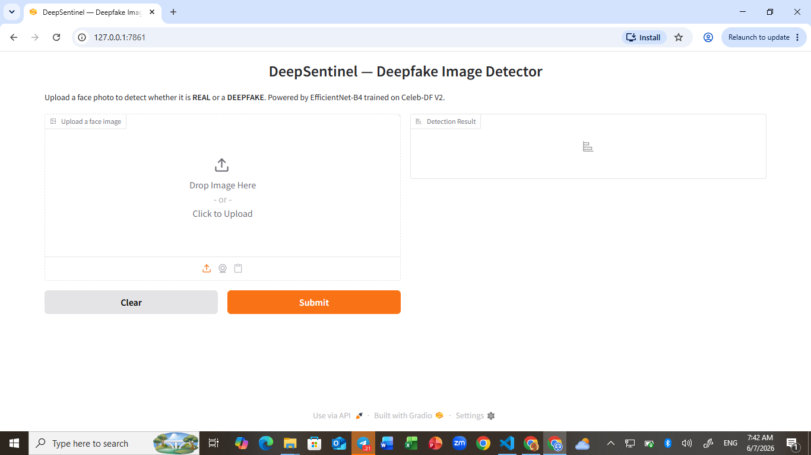

# DeepSentinel — AI-Powered Deepfake Image Detection

DeepSentinel is a binary deepfake image classifier that detects whether a face photo is **REAL** or a **DEEPFAKE**. Built with EfficientNet-B4 and trained on the Celeb-DF V2 dataset.



---

## Features

- Upload a face image or use your **webcam** directly in the browser
- Real-time classification: **REAL** or **FAKE** with confidence score
- Face detection preprocessing — automatically crops the face before analysis
- REST API via FastAPI for programmatic access
- Docker support for easy deployment

## Quickstart

```bash
# Install dependencies
pip install -r requirements.txt

# Run the Gradio UI
python app/gradio_app.py
```

Open `http://127.0.0.1:7860` in your browser.

## Project Structure

```
DeepSentinel/
├── app/
│   ├── gradio_app.py       # Gradio web UI
│   └── api.py              # FastAPI REST endpoint
├── src/
│   ├── model.py            # EfficientNet-B4 model definition
│   ├── detector.py         # Inference + face detection
│   ├── train.py            # Training loop
│   ├── evaluate.py         # Evaluation metrics
│   └── preprocess.py       # Image transforms
├── notebooks/
│   └── 03_training.ipynb   # Kaggle training notebook
├── models/weights/         # Place efficientnet_b4.pth here
├── data/processed/         # Training data (not tracked by git)
├── Dockerfile
└── docker-compose.yml
```

## Model

| Property | Value |
|----------|-------|
| Architecture | EfficientNet-B4 |
| Parameters | ~17.5M |
| Training Dataset | Celeb-DF V2 (101,031 face images) |
| Input Size | 224 × 224 |
| Output | Binary (REAL / FAKE) |

## Training

Training is done on Kaggle (free T4 GPU, ~1–2 hours for 10 epochs):

1. Open `notebooks/03_training.ipynb` on [Kaggle](https://kaggle.com)
2. Add the `celebdf-v2image-dataset` dataset
3. Set accelerator to **GPU T4 x2**
4. Run all cells — weights auto-upload to HuggingFace when done
5. Download `efficientnet_b4.pth` and place it at `models/weights/efficientnet_b4.pth`

## API

```bash
uvicorn app.api:app --host 0.0.0.0 --port 8000
```

```bash
curl -X POST http://localhost:8000/predict \
  -F "file=@face.jpg"
```

Response:
```json
{
  "label": "FAKE",
  "fake_prob": 0.92,
  "confidence": 0.92
}
```

## Docker

```bash
docker-compose up
```

- Gradio UI → `http://localhost:7860`
- FastAPI → `http://localhost:8000`

## Dataset

[Celeb-DF V2](https://github.com/yuezunli/celeb-deepfakeforensics) — 101,031 pre-extracted face images split into train / val / test across real and fake classes.

## License

MIT
